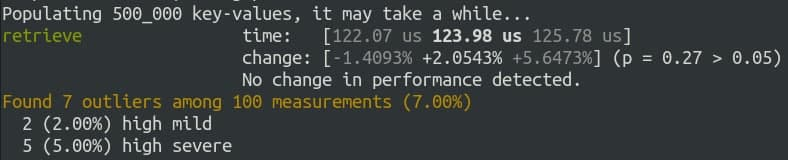

## Kv-store

Simple key-value store database.

### Up & Running

1. Install the latest stable version of Rust.
2. Run `cargo run --bin server`.
3. The server will start to listen the port 17653.

### Technical Details

Kv_store runs on port 17653 and accepts requests over TCP, the payload format is expected to be
a [bincode encoded](https://github.com/bincode-org/bincode) enum with the desired command (put, get or delete).
You can also interact with the server using the CLI application in this project.

### How to use the CLI app

#### Put

You can put a new key-value with the following command:

`cargo run --bin client -- put <KEY> <VALUE> [SECONDS_TO_EXPIRE]`

The expiration is optional, and if the key already exist it will replace with the new value.

#### Get

You can retrieve the value of a key using the command:

`cargo run --bin client -- get <KEY>`

If the key is expired or doesn't exist, nothing will be returned.

#### Delete

You can delete a key using the command:

`cargo run --bin client -- delete <KEY>`

Success is always returned even if the key doesn't exist.

### Performance

You can check the performance running the following command:

`cargo bench`

The benchmark will start a server, populate with 500k key-value pairs
and then measure the average time to retrieve a random key-value.

Here are the results that I achieved in my computer (Ryzen 5 2700 + 16gb 2444hz):

